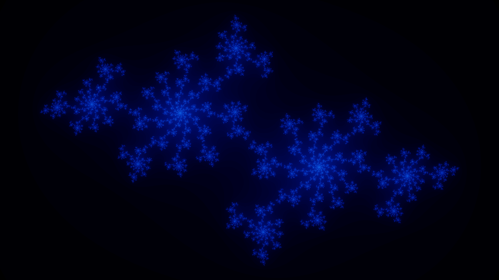

<h1 align="center">Julia Fractal</h1>

Running the `main.cpp` file will automatically generate 3,000 images depicting a zoom-in motion of the fractal.

- 

We can make video of the fractal animation by using an application named `ffmpeg`

